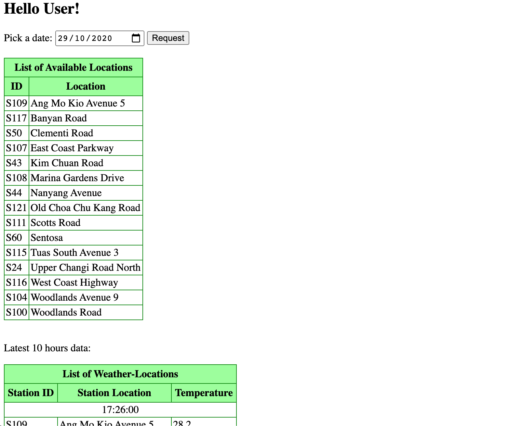

# Weather-App
A simple web app that gets data from https://data.gov.sg/dataset/realtime-weather-readings and displays them onto tables.

## Set-up
Brief explanation on the set-up in general:
- Tomcat server on Oracle Cloud Infrastructure (OCI) Instance
- Java, JSP on Eclipse, Netbeans or any other IDE that supports

Languages: HTML, CSS, JavaScript, JQuery, JSP, JSTL

## Display 
Here is how it will look like roughly:

